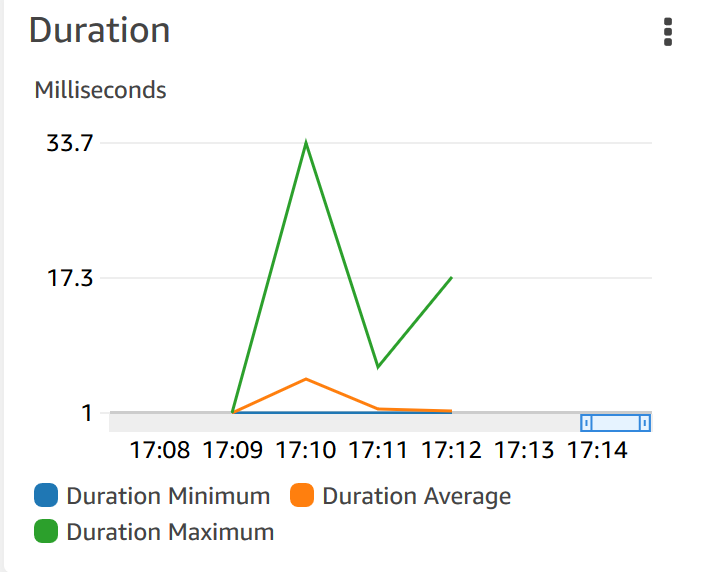

# Load Testing

# microframework comparison

Comparing the run time of the break even function written in different Microframeworks.
Comparison is done by running them localy via minikube and load testing with locust.

|      | Micronaut | Quarkus | Kotless |
| :--: | :-------: | :-----: | :---:   |
| mean | 13        | 10      |         |
| min  | 2         | 3       |         |
| max  | 50        | 44      |         |

Since both frameworks use graalVM to create a native executable, the execution time is quite similar with no significant difference betweend them

## comparison to spring 
|      | Micronaut | SPRING | delta  |
| :--: |:--------: | :----: | :----: |
| mean | 13        | 0      | 0      |
| min  | 2         | 0      | 0      |
| max  | 50        | 0      | 0      |

---

# Platform comparison

Comparing the break even function written with Micronaut on different Serverless Platforms.
Load Testing done via locust framework.

|     | local  | Knative | OpenFaas | FN    | AWS Lambda| Azure |
|:---:| :----: | :-----: | :------: |:----: | :--------:| :---: |
| mean| 13     | 6       | 16       | 0     | 5.11      | 0     |
| min | 2      | 3       | 5        | 0     | 1.34      | 0     |
| max | 50     | 23      | 92       | 0     | 33.7      | 0     |

- significant difference between knative and OpenFaas

### cold start

Each platforms required execution time for a cold start, i.e. when there are no active replicas.

#### Execution time for a single request

|          |  Knative | OpenFaas | FN    | AWS Lambda | Azure |
| :------: | :------: | :------: | :---: | :--------: | :---: |
| duration | 0        | 260      | 0     | 0          | 0     |

#### Starting a lot of requests on cold start

|      | Knative | OpenFaas | FN  | AWS | Azure |
|:---: |:-------:|:--------:|:---:|:---:|:-----:|
| mean |         | 20       | 0   | 0   | 0     |
| min  |         | 7        | 0   | 0   | 0     |
| max  |         | 9326     | 0   | 0   | 0     |
| avg  |         | 260      | 0   | 0   | 0     |

OpenFaas has a very high max execution time if a lot of requests come in at the same time on a cold start.
Explanation?

## AWS

###  Jar vs Native

tested on the break even function written with micronaut in kotlin, using the aws package for the jar execution, and the graalvm and custom-runtime package for the execution using the native image.

|                             |      FAT JAR |    Native | 
| :-------------------------: | :----------: | :-------: |
| cold startup initialisation |      3956 ms |    473 ms |
| cold start duration         |      104.58  |    27.22  | 
| warm start                  |      3.89    |    1.31   | 
| memory usage average        |      170 MB  |    146 MB |

### API Gateway

#### using jar function

|      | With API Gateway | Pure Lambda | 
| :--: | :--------------: | :---------: |
| mean | 22               | 5.11        | 
| min  | 16               | 1.34        | 
| max  | 1024             | 33.7        | 

####  using native image function

|      | With API Gateway | Pure Lambda | 
| :--: | :--------------: | :---------: |
| mean | 19 ms            |             | 
| min  | 16 ms            |             | 
| max  | 517 ms           |             | 

- no access to lambda edge on students account, but probably low overhead => comparable to pure lambda stats?

- note: billing in steps of 100ms?
 
execution duration for the lambda
 

