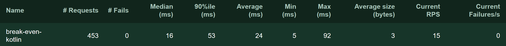

# Serverless Landscape

- [serverless landscape](https://landscape.cncf.io/format=serverless)

- [faastener](https://faastener.github.io/explorer)

# what is serverless?

Serverless in the course of this article will be defined as paradigm to simplify and speed up deployment of code that is 
- event driven
- short lived
- has fast startup 
- abstracted or "hidden" infrastructure

and where this paradigm enables event triggered autoscaling and scale to zero.


# Development

Using Microframeworks that ease the creation of serverless functions has the benefit of reusing the skillset, knowledge and workflow of developers familiar with microservices.
No need to switch to a new framework or workflow if the framework you are using for your microservices also is suited for the creation of serverless functions.

A major benefit of using microframeworks to develop serverless functions is that developers reuse their knowledge and skillset of creating microservices.
There is no new language or development method to "learn" and the workflow remains the same, so that creating serverless functions are seemlessly integrated into the usual workflow.


# Quarkus

Quarkus is a full-stack, Kubernetes-native Java framework mainly aimed at building microservices and tailored for Java virtual machines (JVMs) and native compilation via GraalVM, optimising Java specifically for containers and enabling it to become an effective platform for serverless, cloud, and Kubernetes environments.


- Java Microframework optimized for kubernetes and graalVM
- "Designed for Developers"
  - Hot reload
  -  Unified imperative and reactive programming
  -  Unified configuration
  -  Easy native executable generation
  -  Best-of-Breed Libraries and Standards
- Fast Startup (tens of milliseconds)
  - allows automatic scaling up and down of microservices on containers and Kubernetes as well as FaaS on-the-spot execution
- Low memory utilization
  - Low memory utilization helps optimize container density
- Smaller application and container image footprint
- testing support:
  - hot reload
  - packages to gather metrics 
  - annotations to set up tests easily


## Scaffolding

Quarkus allows to easily setup a scaffold project that includes a simple hello world function and a test.
This boilerplate project helps to quickly set-up a function with minimal effort.

```bash
mvn io.quarkus:quarkus-maven-plugin:1.1.1.Final:create \
    -DprojectGroupId=info.novatec \
    -DprojectArtifactId=breakevencalculator \
    -DclassName="info.novatec.BreakEvenCalculator" \
    -Dpath="/run"
```

- or create via https://code.quarkus.io/

## BreakEvenFunction

Example of a simple BreakEvenFunction achieved via Quarkus.

No Additional code or classes ( no application class either ) needed.

Spring like, self-explanatory annotations:

```java
@GET
@Produces({MediaType.APPLICATION_JSON})
public BreakEvenResponse calculate(@QueryParam double price, 
                                   @QueryParam double fixedCost, 
                                   @QueryParam double unitCost) { 
    int breakEvenPoint =  (int) Math.ceil(fixedCost / (price - unitCost));
    BreakEvenResponse response = new BreakEvenResponse(breakEvenPoint);
    return response;
}
```

### Run the Application in development mode with hot reload

Making changes to the code will automatically and instantly recompile and update the application, making local testing easy.

```bash
./mvnw compile quarkus:dev
```


## Testing

Example of creating a Test for the BreakEvenFunction.
Quarkus annotations for easy setup.

```java
@Inject
BreakEvenResponse response;

@ParameterizedTest
@CsvSource({
        "20.00, 100.00, 10.00, 10",
        "6.00, 1000.00, 4.00, 500",
        "2.30, 333.33, 2.10, 1667",
        "3.00, 8000.00, 1.50, 5334"}
)
public void testBreakEvenFunction(double price, double fixedCost, double unitCost, int breakEvenPoint) {
    response.breakEvenPoint = breakEvenPoint;
    given().queryParam("price", price)
            .queryParam("fixedCost", fixedCost)
            .queryParam("unitCost", unitCost)
            .when().get("/run")
            .then()
            .statusCode(200)
            .equals(response);
}
```

### Run the test
when compiling the quarkus project, all tests will be run automatically.

Explicit test run possible as well via:
```bash
./mvnw test
```

## Extensions: Health

Quarkus provides a set if bst-of-Breed Libraries and Standards to extend your functions with additional metric collection, health services or security tools.

### Adding the package
```bash
./mvnw quarkus:add-extension -Dextensions="health"
```

### Or add following to pom.xml
```xml
<dependency>
    <groupId>io.quarkus</groupId>
    <artifactId>quarkus-smallrye-health</artifactId>
</dependency>
```
### Anotation

- the liveness check accessible at /health/live
    ```java
    @Liveness
    ``` 

- the readiness check accessible at /health/ready
    ```java 
    @Readiness
    ``` 

### Implementing Health check

```java
@Liveness
@ApplicationScoped
public class SimpleHealthCheck 
    implements HealthCheck {

    @Override
    public HealthCheckResponse call() {
        return HealthCheckResponse.
            up("Simple health check");
    }
}
```  

## Extensions: Metrics

### Adding the package
```bash
./mvnw quarkus:add-extension -Dextensions="metrics"
```

### Anotation
```java
@Timed(name = "breakEvenTimer", description = "execution time of breakEvenFunction",
            unit = MetricUnits.MILLISECONDS)
```

### Review generated metrics
```
localhost:8080/metrics/
```

## Running & Packaging

### using maven

- compile in development mode
```bash
./mvnw compile quarkus:dev
```

- package into native executable
```bash
 ./mvnw package -Pnative
```
-   add to pom.xml
    ```xml
    <profiles>
        <profile>
            <id>native</id>
            <properties>
                <quarkus.package.type>native</quarkus.package.type>
            </properties>
        </profile>
    </profiles>
    ```

### - using dockerfile

```yaml
## Stage 1 : build with maven builder image with native capabilities
FROM quay.io/quarkus/centos-quarkus-maven:19.2.1 AS build
COPY src /usr/src/app/src
COPY pom.xml /usr/src/app
USER root
RUN chown -R quarkus /usr/src/app
USER quarkus
RUN mvn -f /usr/src/app/pom.xml -Pnative clean package

## Stage 2 : create the docker final image
FROM registry.access.redhat.com/ubi8/ubi-minimal
WORKDIR /work/
COPY --from=build /usr/src/app/target/*-runner /work/application
RUN chmod 775 /work
EXPOSE 8080
CMD ["./application", "-Dquarkus.http.host=0.0.0.0"]
```

#### References

- [Red Hat: Quarkus introduction](https://developers.redhat.com/blog/2019/03/07/quarkus-next-generation-kubernetes-native-java-framework/)

- [Red Hat: what is quarkus](https://www.redhat.com/en/topics/cloud-native-apps/what-is-quarkus)


---

# Micronaut

"A modern, JVM-based, full-stack framework for building modular, easily testable microservice and serverless applications."

It enables you to write applications in Java, Kotlin or Groovy.


- tailored for graalvm
- fast startup time
- reduced memory footprint
-  compile time dependency injection instead of reflection


    ```java
    @Controller("/")
    class Handler {

        @Consumes(MediaType.APPLICATION_JSON)
        @Post(produces = [MediaType.APPLICATION_JSON])
        fun index(@JsonProperty("price") price: Double,
                @JsonProperty("fixedCosts") fixedCosts: Double,
                @JsonProperty("unitCosts") unitCosts: Double): Int {
            return ceil(fixedCosts / (price - unitCosts)).toInt()
        }
    }
    ```

## Micronaut & Azure functions?


# Kotless

"Kotlin serverless framework"

Focus on simplifying serverless deployment creation workflow

consists of:
- DSL to define serverless applications
  - also offers support for ktor or spring boot
- Gradle Plugin to deploy to AWS (or locally)


## Workflow

add to gradle.build.kts
```yaml
import io.kotless.plugin.gradle.dsl.kotless
import org.jetbrains.kotlin.gradle.dsl.KotlinJvmCompile

group = "com.example.kotless"
version = "0.1"

plugins {
   kotlin("jvm") version "1.3.61" apply true
   id("io.kotless") version "0.1.3" apply true
}

repositories {
   jcenter()
   mavenCentral()
}

dependencies {
   implementation(kotlin("stdlib"))
   implementation("io.kotless", "lang", "0.1.3")
}

tasks.withType<KotlinJvmCompile> {
   kotlinOptions {
       jvmTarget = "1.8"
       languageVersion = "1.3"
       apiVersion = "1.3"
   }
}

```

- testing locally:
  - execute the gradle -> kotless -> local task


---

# Deployment Anywhere

- use language & infrastructure youre familiar with
- one system to manage and operate for all applications
- only serverless from a user perspective  
- avoid vendor lock-in
- avoid limitations of cloud vendors 
  - i.e. timeout
- build functions and microservices in any languange with same deployment mechanism
  - lambda "only" supports java, node, python, c# and go

There is a number of plattforms that enable you to deploy and manage serverless functions.
Nameworthy examples are:
- AWS Lambda
- Microsoft Functions
- Google Cloud Functions
- Apache OpenWhisk
- Fission
- FN Project
- Knative
- Kubeless
- Nuclio
- OpenFaas
  
We will take a look into a few of those
# Knative

"Kubernetes-based platform to deploy and manage modern serverless workloads."

## Benefits
- Focused API with higher level abstractions for common app use-cases.
- Stand up a scalable, secure, stateless service in seconds.
- Loosely coupled features let you use the pieces you need.
- Pluggable components let you bring your own logging and monitoring, networking, and service mesh.
- Knative is portable: run it anywhere Kubernetes runs, never worry about vendor lock-in.
- Idiomatic developer experience, supporting common patterns such as GitOps, DockerOps, ManualOps.
- Knative can be used with common tools and frameworks such as Django, Ruby on Rails, Spring, and many more. 

```yml
apiVersion: serving.knative.dev/v1
kind: Service
metadata:
 name: helloworld-go
 namespace: default
spec:
 template:
  spec:
   containers:
    - image: gcr.io/knative-samples/helloworld-go
      env:
        - name: TARGET
          value: "Go Sample v1"
```

## stats
- Stars: 2700
- Forks: 563
- Commits: 3800
- Contributors: 165
- Issues: 274 


most active of the platforms

## Performance

 
--- 

## cold start buffering

# OpenFaas
OpenFaaS is a framework for building Serverless functions on top of containers and deployment on any cloud or on-premise.
The goal is to enable developers to deploy event-driven functions and microservices to Kubernetes without repetitive, boiler-plate coding.

OpenFaas allows you to write functions in any language for Linux or Windows and package in Docker/OCI image format.
The faas-cli can build a container for your code using a yaml file configuration and language template either from its own template store, or any github repository specifying a template such as [this template for quarkus](https://github.com/pmlopes/openfaas-quarkus-native-template).
This workflow adds a watchdog component to the container and thus allows any process to become a serverless function with auto-scaling and metrics.
This simplifies the deployment of functions greatly so that deploying a function to OpenFaas is effortlessly easy through the ability to deploy functions via UI portal and one-click install.
This workflow and the configuration of a function through yaml is much simpler compared to kubernetes, which is the main strength of OpenFaas.

- typical kubernetes yaml
    ```yaml
    apiVersion: apps/v1
    kind: Deployment
    metadata:
    name: nginx-deployment
    labels:
        app: nginx
    spec:
    replicas: 3
    selector:
        matchLabels:
        app: nginx
    template:
        metadata:
        labels:
            app: nginx
        spec:
        containers:
        - name: nginx
            image: nginx:1.7.9
            ports:
            - containerPort: 80
    ```
- compared to typical OpenFaas yaml
    ```yaml
    version: 1.0
    provider:
        name: openfaas
        gateway: http://127.0.0.1:8080
    functions:
        break-even-kotlin:
            lang: kotlin-maven-mn
            handler: ./break-even-kotlin
            image: straywonderland/break-even-kotlin:latest
    ```

However, the fact that you have to build your images from the ground up can be considered a major drawback.
You cant just ship and deploy your already existing images for functions that have been build for other vendors directly to openfaas. 
Youll have to specify the yaml configuration tailored for openfaas and let the faas-cli build it.

- Portable 
  - runs on existing hardware or public/private cloud 
  -  Kubernetes and Docker Swarm native
- Auto-scales as demand increases

OpenFaas also offers a function-store with some useful predefined functions such as sentiment analysis, face detection, text to speech and nsfw detection.
These functions can easily be deployed via the faas-cli directly from the store.
Developers can also contribute to the function store, which may lead to a great variety of ready to use functions in the future.
 
Auto-scaling in OpenFaas can be configured within the yaml file of a deployed function.
Per default it is set to always keep at least one replica, and scale the number of replicas up to a maximum of 20 if a large amount of requests come in.
This means, that per default, there is no scale-to-zero but that at all times one image is kept up and running for each function.
Keeping a replica up reduces the average response time, since there are no cold starts.
And since youre deploying OpenFaas on a cloud plattform, this does not produce any cost-overhead as it would with a pay-per-use model of serverless providers.
OpenFaas does however support scale from and to zero by editing the configuration for the minimum number of replicas or setting it via
```bash 
kubectl scale deployment --replicas=0 break-even-kotlin -n openfaas-fn 
```
## benefits
- run on any public or private cloud
- Run container based functions on own servers
- runs on docker swarm or kubernetes


## workflow

https://github.com/openfaas/workshop


- create kubernetes or docker swarm cluster
- install openfaas using either helm or arkade
- install faas-cli
- create a function scaffold using faas-cli and specifying desired language
    ```bash
        faas-cli new --lang java breakeven
    ```
    - or add a yaml file to the directory of an existing project
    ```yaml
    version: 1.0
    provider:
        name: openfaas
        gateway: http://127.0.0.1:8080
    functions:
        break-even-kotlin:
            lang: kotlin-maven-mn
            handler: ./break-even-kotlin
            image: straywonderland/break-even-kotlin:latest
    ```
- build image for your function and deploy it directly to openfaas via 
    ```bash faas-cli up```


## stats

- 18.1 stars
- 1.5k forks
- 1,912 regular commits ( mostly lass than a week between commits)
- 150 contributors

OpenFaas seems to be quite active and being continuesly developed.

## Performance


Load testing on micronaut break-even function
| Median        | 90%ile | Min  | Max |
| :-----------: |:------:|:----:|:---:|
| 16    | 53 | 5 | 92 |

 
 

## References

- [openfaas on minikube](https://medium.com/faun/getting-started-with-openfaas-on-minikube-634502c7acdf)
- [what is openfaas and why is it an alternative to aws lambda](https://www.contino.io/insights/what-is-openfaas-and-why-is-it-an-alternative-to-aws-lambda-an-interview-with-creator-alex-ellis)


---
---

# FN Project

The Fn project is, as the developers describe it on their [homepage](https://fnproject.io/), an open-source container-native functions-as-a-service platform that you can run anywhere.
So wether you want to deploy serverless functions on a cloud vendor architecture or on-premise, Fn project delivers easy to use deployment of functions written in any programming language.

## Benefits
- scaffolding
- function development kits for mapping in and output
- focus on ease of deployment on any cloud and on-premise
- load balancing
- hot containers for fast response time
- one system to manage and operate for all applications
- avoid vendor lock-in

## Deployment workflow?
[Getting started with FN Guide](https://fnproject.io/tutorials/JavaFDKIntroduction/)

- setup server 
    ```bash
    fn start
    ```

- scaffolding per cli
    ```bash
    fn init --runtime java breakevencalculator
    ```
    - edit code

- or add a configuration file to an existing repo
    ```yml
    schema_version: 20180708
    name: javafn
    version: 0.0.1
    runtime: java
    build_image: fnproject/fn-java-fdk-build:jdk11-1.0100
    run_image: fnproject/fn-java-fdk:jre11-1.0.100
    cmd: com.example.fn.breakeven::handleRequest
    ```
- Create your app
    ```bash
    fn create app breakeven-app
    ```

    an app is a collection of functions that you can use to organise your functions

- deploy your function
    ```bash
    fn deploy --app breakeven-app --local
    ```

- invoke the deployed function
    ```bash
    fn invoke breakeven-app breakevencalculator
    ```

## stats

- Stars: 4700
- Forks: 348
- Commits: 3400
  - last in dec 2019
  - semi active
- Contributors: 86
- Issues: 121 


--- 
---

# RIFF is for functions

riff is an Open Source platform for building and running Functions, Applications, and Containers on Kubernetes. 

- simplifies deployment and iteration workflow
  ```bash
  riff function create breakeven \
    --git-repo https://example.com/my/repo \
    --image my/breakeven
  ```
- CLI to create and deploy functions
- create knative deployments easily
- streaming??
  
---
---

# Kubeless

Kubeless is a Kubernetes-native serverless framework that lets you deploy functions without having to worry about the underlying infrastructure. It is designed to be deployed on top of a Kubernetes cluster and take advantage of all the great Kubernetes primitives. If you are looking for an open source serverless solution that clones what you can find on AWS Lambda, Azure Functions, and Google Cloud Functions, Kubeless is for you!

Kubeless Includes:
- Support for Python, Node.js, Ruby, PHP, Golang, .NET, Ballerina
- supports custom runtimes
- CLI compliant with AWS Lambda CLI
- Event triggers using Kafka messaging system and HTTP events
- Prometheus monitoring of functions calls and function latency by default
- Serverless Framework plugin


# Deployment on FAAS vendors


# AWS lambda

AWS lambda is among the most popular serverless function plattform vendors.

- upload code via CLI or link to github repo
- supports various different runtimes such as java, nodejs, python, Go ...
  - custom runtimes can be specified too
  - micronaut and quarkus provide packages for aws lambda with their own runtime for native executables

## workflow

- create functions either via the aws console or via the CLI called SAM
    - SAM provides commands for initialising, building and deploying functions as well as local testing.
- for using the web console
  - create a jar or zip file and upload it

### using Microframeworks

- Micronaut and Quarkus offer packages to build functions optimised for lambda
- Application can be deployed either using the lambda java runtime, or by bulding a native executable with a custom runtime provided by the corresponding package
  - easy native packaging and deployment
  - ```bash mn create-app info.novatec.break-even --lang=kotlin --features aws-lambda,graalvm ```
  - either create a jar file or let the aws lambda package create a zip folder to upload
  - use lambdas java runtime or custom runtime for native executables
  - both frameworks also provide scripts to test application localy via SAM
  

#### functions.zip

- contents of function.zip using graalvm to create a executable:
    - bootstrap
        ```bash 
        #!/bin/sh
        set -euo pipefail
        ./break-even-mn-lambda -Xmx512m
        ```
    - break-even-mn-lambda binary file

- function.zip for quarkus:
  - bootstrap binary file

- regular function-zip generated:
```  
  - io
    - quarkus 
      - ...
  - javax
    - ...
  - lib
    - com.amazonaws....
    - ...
  - META-INF
    - services
    - MANIFEST.MF
  - info\novatec\
    - BreakEvenRequestHandler.class
  - application.properties
```
### using SAM
  - test, build and deploy via SAM
    - local test:
        - initiate api
            ```bash
            sam local start-api
            ```
        - single invocations
            ```bash
            sam local invoke "break-even-kotlin" -e events/event.json
            ```
    - build: 
        ```bash
            sam build
        ```
    - deploy: 
        ```bash
            sam deploy --guided
         ```
   
- requires a yaml file
    ```yaml
    AWSTemplateFormatVersion: '2010-09-09'
    Transform: AWS::Serverless-2016-10-31
    Description: AWS Serverless Micronaut API - example.micronaut::prime-finder
    Globals:
    Api:
        EndpointConfiguration: REGIONAL
    Resources:

    BreakEvenKotlin:
        Type: AWS::Serverless::Function
        Properties:
        Handler: not.used.in.provided.runtime
        Runtime: provided
        CodeUri: build/function.zip
        MemorySize: 128
        Policies: AWSLambdaBasicExecutionRole
        Timeout: 15
        Events:
            GetResource:
            Type: Api
            Properties:
                Path: /{proxy+}
                Method: any

    Outputs:
        BreakEvenKotlin:
            Description: URL for application
            Value: !Sub 'https://${ServerlessRestApi}.execute-api.${AWS::Region}.amazonaws.com/Prod/find-primes-below/{number}'
            Export:
            Name: BreakEvenKotlin
    ```

- workflow is simplified further by the serverless framework


#### FAILED:
maven only deploy.sh version works somewhat

quarkus:
- mvnw package -Pnative failed => FIXED
- generates function zip
- lambda generates runtime exit error

gradle version:
- includes no deploy.sh or dockerfile
- gradlew nativeImage failed (FIXED to at least produce native executable -> no function.zip tough)
- gradlew dockerBuldNative failed
- gradlew assemble and then 
    ``` 
    native-image --no-server -cp buold/libs/break-even-mn-lambda-0.1-all-jar 
    ``` 
    failed


maven:
- sam-local.sh failed
- mvnw package -Dnative succesful for micronaut BUT
  - did not actually build a native image?
- mvn package then native-image failed

complete repo:
- for the "complete" sample repos: uploading jar does not work -> results in timeout 
- building example projects function.zip works (via deploy.sh)
  - default function (json) calls are successfull but return 405 code 
  - FIXED: use api-gateway test instead of simple function test since application sample uses api gateway for requests
  - RESULT: 800 ms warm start , 2140 ms cold start

packages
- aws-lambda + graalvm failed
- aws-lambda + aws-lambda-customruntime + graalvm failed
- aws-lambda-customruntime + graalvm failed
- example "complete" project includes aws + customruntime + graal (doc does not mention customruntime tough)
- custom runtime package failed -> use only aws + graalvm ?
  - building works but calling fails with runtime exiting without providing a reason

=> note:
    maybe runtime error caused by difference between amazon linux and system used to build native image

## Performance


---
# Azure Functions

--- 

# Serverless Framework

- simplifies configuration and deployment of functions to aws lambda, azure functions etc.
- streamlines deployment across different vendors


---

#### ERROR CORRECTION
in complete:
increase Xmxx size to at least 256 in bootstrap file to function properly

#### jar: 
- cold start up : 3965
- warm start : 8.55 ms

- max memory: 170 MB
- 
#### graalvm function.zip: 400 ms
- cold start function duration 190 ms
- cold start up : 473 ms
- warm start 2.16 ms

- max memory 235 MB
